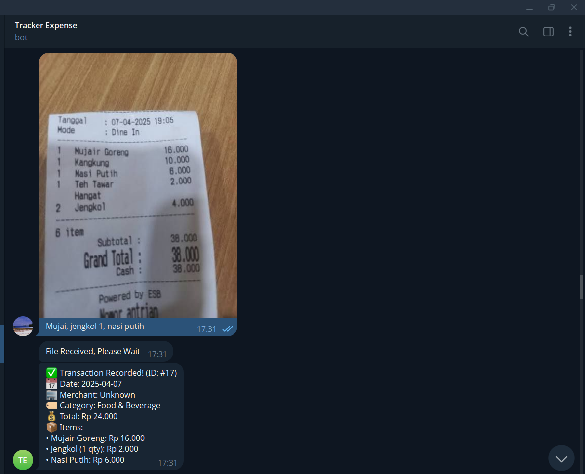
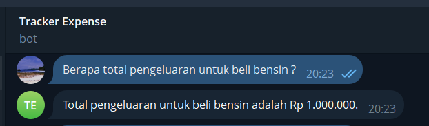

# Expense Tracker — n8n Telegram bot

Telegram bot that logs expenses and answers questions about them. Send a receipt photo or a one-line entry like `coffee 35k`, then ask `how much did I spend on food this month?` Each Telegram user only ever sees their own data.

**Try it live:** message [**@Raytestmodel2bot**](https://t.me/Raytestmodel2bot) on Telegram.

Built as a set of 4 n8n workflows using Gemini and PostgreSQL. A portfolio project.

## Tech stack

| Layer | What |
|---|---|
| n8n (self-hosted) | Orchestration — 4 interlinked workflows, cross-workflow execution |
| Gemini (googleGemini nodes) | Intent classification, receipt vision extraction, SQL generation, answer formatting |
| PostgreSQL | `users` + `transactions`; `line_items` as jsonb; index on `(telegram_id, date)` |
| Telegram Bot API | Trigger, messages, inline-keyboard delete buttons, callback queries |
| JavaScript (Code nodes) | SQL allow-list guard + user-scoping CTE wrapper |

## Workflows

| File | Purpose |
|---|---|
| `workflows/Tracker Expense.json` | Orchestrator — Telegram trigger, intent routing, commands |
| `workflows/Sub-Tracker.json` | Turns a receipt photo or text entry into a transaction row |
| `workflows/Sub-Query.json` | Answers plain-language spending questions |
| `workflows/Tracker Expense Log.json` | Error handler — pages the owner when any workflow fails |

Flow:

```
Telegram → Tracker Expense
            ├─ /start            → welcome + usage guide
            ├─ delete_<id>       → DELETE scoped to sender → confirmation
            ├─ TRACK (photo)     → Sub-Tracker: receipt OCR
            ├─ TRACK (text)      → Sub-Tracker: manual parse
            └─ QUERY             → Sub-Query: SQL + answer
All executions → errors → Tracker Expense Log → owner alert
```

## How a receipt becomes a transaction

Sub-Tracker sends the photo to Gemini Vision with an extraction prompt. Notable behavior:

- If the caption names items (`mujair, kangkung, nasi`), **only those items** are taken from the receipt and the total is their sum. No caption → the whole receipt is used.
- Amounts are normalized to integer rupiah: `Rp 35.000` → 35000, `35k` → 35000, `50rb` → 50000.
- Output is validated JSON: date, time (nullable), total_amount, merchant, category (from a fixed list), line_items array.
- `line_items` is stored as `jsonb`; string values are single-quote-escaped before the INSERT.
- Text entries (`coffee 35k`) take the same path through a parsing prompt that fills in today's date/time when absent.

The reply includes a Delete button that is stripped after 3 minutes (Wait node + `editMessageText`) so stale buttons can't delete newer rows.

## How a question becomes an answer

1. **Generate SQL (Gemini)** — the prompt restricts the model to a fixed column set (`id, date, merchant, category, total_amount, line_items`), tells it to search `line_items` via `::text ILIKE` for brand/item queries (e.g. `pertamax`), and returns only a SELECT.
2. **Guard & Scope SQL (JavaScript)** — rejects anything that doesn't start with `SELECT` or contains stacked statements / destructive keywords. Then wraps the query:
   ```sql
   WITH my_expenses AS (SELECT * FROM transactions WHERE telegram_id = <user>)
   <generated SELECT>
   ```
   so the query the model wrote executes against that user's rows only.
3. **Run Query (Postgres)** → **Format Answer (Gemini)** — results are rephrased in plain language, amounts formatted as Rupiah, empty results explained politely.

Real exchange — the brand/item search inside `line_items` JSON in action:

## Demo





## Database

`schema.sql` — two tables:

- `users` — `telegram_id` (PK), username, first_name; upserted on first expense.
- `transactions` — id, telegram_id (FK → users, `ON DELETE CASCADE`), date, time, total_amount (integer rupiah), merchant, category, line_items (`jsonb`), created_at. Index on `(telegram_id, date)` for the monthly/weekly queries.

## Setup

Requirements: n8n, a Telegram bot token (from @BotFather), a Gemini API key (Google AI Studio), PostgreSQL.

1. Run `database/schema.sql` against your database.
2. Import all four workflow files (Workflows → Import from File). Save each once so webhook IDs regenerate.
3. Credentials are blanked in the exports on purpose — create your own `telegramApi`, `googlePalmApi`, and `postgres` credentials and attach them where n8n flags them missing.
4. Open **Tracker Expense → Settings → Error Workflow** and pick **Tracker Expense Log** (the reference is regenerated per instance, so this needs re-pointing after import).
5. Activate the workflows.

## Notes

- Real keys, chat IDs, and test data are not in this repo — exports are scrubbed (credentials blanked, webhook IDs removed, pinned data emptied).
- Text in the user-facing prompts is a mix of English and Indonesian; receipts/replies handle Indonesian amounts and categories.
- AI extraction can misread a receipt — the delete button is the intended correction path.
